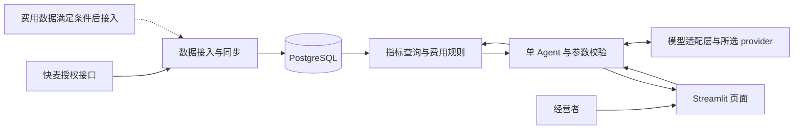

# 电商经营数据库 Agent：第一版技术选型与设计

日期：2026-09-06。状态：设计评审稿；已按用户授权完成少量商家接口只读抽样，尚未实现业务应用或完成财务对账。

目标：经营者用自然语言查看指定期间的经营情况，并在数据充分时获得可核对的推广费用控制建议。优先完成一个公司内部可用的业务闭环，模块按职责划分，便于开发与面试讲解。

## 1. 已知事实与数据结论

- 用户明确：目前只有快麦 ERP 数据，希望先确认是否包含推广费用。
- 启动设计时工作区根目录只有 `.env` 和参考项目；当前新增设计与数据核验文档，尚未形成业务应用，也未初始化根目录 Git 仓库。
- `.env` 中存在 `KUAI_MAI_APP_KEY`、`KUAI_MAI_APP_SECRET`、`KUAI_MAI_APP_TITLE`、`KUAI_MAI_COMPANY_ID`、`KUAI_MAI_ACCESS_TOKEN`、`KUAI_MAI_REFRESH_TOKEN` 六个配置名。初步检查仅提取名称；用户随后明确允许实际拉取，临时探针在本地读取凭证，只向官方文档指定网关发送鉴权请求，未输出凭证值。未发现模型和数据库配置名。
- 已阅读本地 OpenChatBI 的 README、依赖、主 Agent 和 Text2SQL 链路。本地版本为 `1.0.0b1`，提交 `c8786cb`，提交日期 2026-08-15；不据此声称它是上游最新版。

### 快麦是否提供推广费用

**现在能确认的是：公开接口文档及本次订单/出库/售后样本均未找到广告消耗、推广费用或广告归因报表，不能认定现有密钥可以直接取得这些数据；也不能据此断言快麦所有产品都没有这些数据。**

2026-09-06 核查官方接入指南、公开文档索引及全文，有以下证据：

| 事实 | 对设计的影响 |
| --- | --- |
| 官方指南明确“报表/智库模块的接口为增值接口”，需联系销售或实施获取报价和文档 | 已有基础 API 凭证不能证明已开通相关报表；推广模块不能依赖一个尚未确认的接口 |
| 官方说明公开全文不包含增值、未发布和商家专属接口 | 公开文档的负面检索结果有范围限制；实际能力需要专属文档和账号实测才能定案 |
| `erp.trade.list.query` 明确不包含淘系、拼多多订单 | 需要根据店铺平台选择获授权的数据通道，不能默认全平台订单可拉取 |
| `erp.trade.outstock.simple.query` 对淘系、拼多多屏蔽部分平台字段，例如文档注明不返回 `platformPaymentAmount` | 有出库记录并不等于拥有完整支付金额；出库业绩不能冒充支付 GMV |
| 售后接口区分 `rawRefundMoney`（平台实退）、`refundMoney`（系统实退）及平台完成时间 | 有售后工单不代表已发生平台退款，不能直接把所有售后单求和当退款额 |

推广数据接入的业务核验清单：请快麦实施确认是否有“按日期 × 店铺 × 推广渠道”的实际消耗、数据来源、金额单位、是否含税、更新时点、回溯修正、账号权限与费用；若支持广告计划分析，还要核实计划 ID、归因成交额、归因窗口和退款处理。这里是待取得的事实，不是拟造的 API 参数。

### 首轮账号只读实测结果（5次请求）

用户授权原话：“可以实际拉取查看”。本次共5次只读请求，涉及4种文档确认的查询接口；没有刷新Token、修改ERP记录或猜测调用未发布接口。响应仅在临时进程内处理，输出平台分布、样本量和字段覆盖统计，没有保存原始业务响应、店铺名、订单号或客户信息。

店铺查询第一页面大小50，实际返回42条，其中 `state=3` 的启用记录33条；这里统计的是本次返回的ERP店铺记录，不等于公司所有平台的实际活跃销售店铺。

| 平台 | 返回店铺记录 | 启用记录 |
| --- | ---: | ---: |
| 淘宝 | 10 | 9 |
| 天猫 | 2 | 2 |
| 拼多多 | 16 | 13 |
| 抖音（fxg） | 4 | 4 |
| 京东 | 1 | 1 |
| 快手 | 2 | 1 |
| 微信视频号 | 3 | 1 |
| 1688 | 1 | 0 |
| 淘工厂（alibabac2m） | 2 | 1 |
| 微商相册（wsxc） | 1 | 1 |

业务抽样限定源修改时间为北京时间2026-09-05 00:00:00至23:59:59，每次最多20条。这是更新记录抽样，不能据此计算当天销售额或推断全公司的单量。

| 接口与抽样范围 | 实测 | 关键字段覆盖 |
| --- | --- | --- |
| 一个抖音店铺的普通订单 | 成功，返回20条，`hasNext=true` | `payAmount`、`payment`、`payTime`、`orders`均20/20非空；`platformPaymentAmount`为0/20 |
| 同一抖音店铺的销售出库 | 成功，返回20条，`hasNext=true` | 上述字段覆盖相同 |
| 一个淘宝店铺的销售出库 | 成功，返回20条，`hasNext=true` | `payAmount`、`payment`、`payTime`、`orders`均20/20非空；`platformPaymentAmount`为0/20 |
| 一个抖音店铺的售后 | 成功，返回14条 | `rawRefundMoney`、`refundMoney`、`onlineStatus`均14/14非空；`platformCompleteTime`为9/14 |

非空统计包含0金额，不能代替字段语义和金额准确性验证。售后尚未完成时完成时间可以为空，9/14不能解释为接口故障率。订单样本中 `grossProfit` 非空，但成本维护和退款处理尚未核对，不能直接报告净利润。

实测后的范围建议：**第一条纵向闭环选一个抖音店铺；淘宝、天猫和拼多多合计28条店铺记录，必须作为后续明确的接入里程碑，不因普通接口受限而忽略。** 淘宝出库已能抽样，可先核实ERP出库业绩口径；完整支付订单及平台受限字段仍按对应授权通道接入。推广增值接口的存在、权限和字段仍未获证实。

### 根据官方索引的再次复核（新增25次请求）

用户随后提供 `https://open.kuaimai.com/llms.txt` 要求再次核验。本轮重新读取官方索引与全文，实测12种查询接口，共25次只读请求。详见[快麦可拉取数据复核](../research/2026-09-06-kuaimai-data-verification.md)及同目录脱敏统计JSON；以下结论作为当前接入依据：

- 抖音、淘宝、天猫的交易出库样本各20条，实付和订单成本均为正数；订单与商品成本已有数据，应保留源成本做ERP成本参考，并继续完成拆合单/成本公式对账。
- 拼多多20条出库样本缺少`payAmount/payment/tid/modified`，虽然有ERP单据及部分成本，仍不能纳入完整支付销售指标。拼多多售后另取到8条，有退款金额，但不能据此推出完整销售覆盖。
- 商品档案3个、实际成交商品SKU8个均取得当前成本；库存状态和分仓库存也取得样本，可按需要作为补充。它们不自动提供历史库存。
- 历史成本、仓储销售出库单、销退入库和采购的定向补查返回`success=true`但未取得记录；后三类补查返回`total=0`。这些数据不作为第一版必需依赖，也不能被称为无权限或全公司没有数据。
- 四个平台出库样本的实际运费均缺失、包材成本均为0；完整净利润不能据此计算。推广实耗仍未找到公开查询方法或实际样本，需确认增值报表。
- 同步器须处理成功响应省略空列表的情况，按完整字段路径定义成本粒度及元/分转换；交易、售后、仓储的时间参数不同，不使用同一套未经区分的增量参数。

### 第一版可交付能力

| 可用数据 | 可以提供 | 不能声称已提供 |
| --- | --- | --- |
| 只有完整 ERP 经营数据 | 期间概览、趋势、店铺/商品排行、同长度上期比较；用户明确输入假设后进行费用情景测算 | 实际推广消耗、真实投产比、具体广告计划的增减预算建议 |
| 增加店铺日推广实耗 | 费用率、预算消耗进度、剩余日均可花额度、店铺整体费用预警 | 广告计划归因或广告带来的增量收益 |
| 再有同口径广告归因成交与成本数据 | 平台口径 ROAS、候选计划复核清单、带前提的预算调整建议 | 因果收益预测、必然有效的最优预算 |

若快麦不能提供第一种费用报表，最小补齐方式是业务人员导出并导入一张 CSV，或在对话中输入一组明确标注的测算假设；是否增加此数据来源由用户选择。没有费用数据时，费用复盘功能显示“缺少推广实耗”，不把缺失金额当 0，也不伪造实绩。

## 2. 三种实现路线与推荐

| 路线 | 优点 | 代价 | 结论 |
| --- | --- | --- | --- |
| A. Python 单体 + 少量业务工具 + 参数化 SQL | 指标一致、调用路径短、容易测试，能用自己的业务闭环讲清楚 Agent | 暂不支持任意表、任意 SQL 问法 | **推荐作为第一版** |
| B. 在 OpenChatBI 上裁剪，保留 LangGraph + 受限 Text2SQL | 更接近参考项目，开放查询能力较强 | 要理解并维护表检索、图状态、SQL校验、重试及较多依赖；金额口径仍需自己建设 | 开放探索成为明确需求时再选 |
| C. 通用 BI 平台、多 Agent、向量库和独立数仓 | 通用性强 | 当前两个业务目标用不到，增加排错和部署成本 | 第一版不采用 |

参考 OpenChatBI 不等于必须把它作为整个项目的底座。它的主图默认组装 SQL 子图、分析 Agent、Python 执行等工具；依赖还包含记忆、向量检索、MCP 和多套 UI。只删界面功能未必能消除这些运行依赖。

路线 A 的真实定位是“以业务工具查询数据库的对话 Agent”：模型选择工具、理解时间与维度、衔接追问、解释已计算结果，查询由可验证的业务代码执行。面试时不将其包装成已实现的通用 Text2SQL。

### 具体技术选型

| 部分 | 第一版选择 | 理由与边界 |
| --- | --- | --- |
| 语言与依赖管理 | Python 3.11 + uv | 与参考项目语言一致；同步、SQL、对话和图表共用一种语言 |
| 页面 | Streamlit | 原生聊天、表格、筛选和图表足够完成内部工具；一个页面即可 |
| 业务服务 | 普通 Python 模块/函数 | 由页面和同步命令直接调用；第一版不额外维护 FastAPI 和前端工程 |
| 数据库 | 一套 PostgreSQL，实施时锁定受支持的大版本 | 交易去重、事务、水位、查询及读写角色由同一个数据库解决；若公司已有可复用 MySQL，应先评估复用，无需双库适配 |
| 数据库访问 | psycopg 3 + 显式 SQL | 以分析聚合为主，暂不引入 ORM/repository 通用抽象；金额用 NUMERIC 和 Python Decimal |
| 模型 | provider 可配置，第一版支持 `qwen`、`deepseek`，每次部署选用一个 | 核心门槛是中文业务理解和 Tool Calling/结构化参数能力；具体型号按 20 道真实问题评测后锁定，不凭宣传指定“最强” |
| 模型访问 | `llm.py` 中的一层薄适配，统一调用入口与工具调用结果 | 兼容同一协议的 provider 共用客户端；业务代码不依赖供应商 SDK 类型，配置切换不修改 Agent 和指标模块 |
| 工具参数校验 | Pydantic | 对时间、指标、维度、店铺、范围、预算假设做枚举和类型校验 |
| 快麦访问 | httpx；签名用标准库 hmac/hashlib | 官方 HTTP API 足够；SDK 已依赖 httpx 时直接复用依赖，签名按官方协议实现 |
| 数据调度 | 一个同步命令 + Windows 任务计划程序；Linux 部署用系统定时器 | 默认每小时一次、单实例执行，不在 Streamlit 页面重运行过程中启动调度器 |
| 图表 | Streamlit 原生折线/柱状图、数据表 | 曲线展示趋势、柱图展示排行；确需复杂交互再增加 Plotly |
| 业务指标与规则 | Python/SQL 常量映射 + 一份指标说明 Markdown | 少量表与指标直接给模型描述，不用向量检索 |
| 验证与观测 | 标准库 unittest + 脱敏结构化日志 + 一份问答验收集 | 验证金钱计算、同步幂等和业务参数；暂不建设独立观测平台 |

云模型使用以公司允许的服务与数据范围为前提；只给模型必要的聚合结果、指标解释和匿名化展示标签，不发送订单明细、客户信息或接口凭证。模型具体型号和费用尚未实测，不在设计阶段虚报性能。

### 模型抽象与 provider 选择

按用户要求保留模型供应商选择能力，将差异集中在一个 `bi_agent/llm.py` 文件内。依赖方向为 `agent.py → 模型调用接口 → 已选择的 provider`，指标查询和费用计算完全不感知 provider。

| 配置 | 用途 |
| --- | --- |
| `LLM_PROVIDER` | 第一版枚举 `qwen` / `deepseek`；不认识的值在启动时明确报错 |
| `LLM_MODEL` | 当前 provider 的具体模型 ID，显式配置，不在业务代码里写死 |
| `QWEN_API_KEY` / `DEEPSEEK_API_KEY` | 按所选 provider 读取对应凭证；只要求当前选中的凭证存在，防止切换地址时误用另一家的密钥 |
| `LLM_BASE_URL` | 可选，由部署者覆盖当前 provider 的服务地址；默认地址来自该 provider 的官方文档，在实施时核实 |

第一版选择在启动时生效，修改配置后重启；不增加管理页面或对话内动态切换。模型调用接口只包含当前 Agent 需要的能力：

- `create_model(settings) → ChatModel`：校验 provider、模型、地址与凭证，返回当前配置的客户端。用一个小映射或条件分支创建，`ChatModel` 只需一个轻量类型协议，不建设类继承体系或插件注册中心。
- `ChatModel.complete(messages, tools) → ModelReply`：接收统一消息和 JSON Schema 工具定义，返回正文、工具调用及可用的 token 用量。业务侧只使用这个方法；SDK 对象留在适配层内部。
- `ModelReply` 的公共字段为 `text`、`tool_calls`、`usage`。每个工具调用必须保留 `id`、`name`、解析后的 `arguments`；工具结果用同一个调用 ID 回传。用已有 Pydantic 表达这些结构；用量未提供时记为未知，不能当成0。
- 消息保留角色、正文、工具调用和工具结果关联；若所选模型协议要求回传额外的推理内容或签名等上下文，由适配层保留并按原协议回传，不能在归一化时丢弃，也不把它展示成用户回答。

两个 provider 若通过已验证的兼容协议提供所需能力，共用一个适配实现和一个 SDK；不要仅因供应商名称不同就复制两套客户端。以后接入不同协议时，在同一模块增加必要的转换；文件职责过重时才拆分。

供应商提供兼容接口不等于模型能力完全一致。第一版统一使用 Tool Calling 加服务端 Pydantic 校验，不把某一家特有的严格结构化输出参数发给所有 provider。所选模型必须完成“发起工具调用 → 接收工具结果 → 给出回答”的验证；不支持时明确提示更换模型，不静默退化成模型猜测数据。

超时、认证失败、限流、工具参数格式错误向 Agent 返回一致的错误分类，保留脱敏的 provider、model 和请求标识供排查。沿用整个回答30秒的总预算；适配层与 SDK 不叠加各自独立的多轮重试。第一版不自动切换供应商，不做负载均衡、成本路由或专用流式事件协议。

## 3. 模块、依赖和数据流



一套代码、一个应用进程、一套数据库，外加定时运行的同步命令。以下是代码职责，全部位于同一项目，不是微服务。

| 模块 | 做什么 | 输入 → 输出 | 依赖 |
| --- | --- | --- | --- |
| 数据接入 | 签名、授权维护、分页、增量拉取、白名单字段清洗、幂等入库 | 接口窗口 → 规范化事实与同步状态 | 快麦、数据库写入角色 |
| 指标查询 | 定义金额/订单/退款口径，完成聚合、比较和排行 | 校验后的查询参数 → 数值、图表数据和口径 | 数据库只读视图 |
| 费用辅助 | 按确定公式计算费用率、剩余预算和情景阈值 | 指标结果 + 已确认的预算/假设 → 计算依据与建议条件 | 指标查询；不自行调用外部广告平台 |
| 对话编排 | 理解问法、选择工具、追问歧义、保存当前筛选状态、解释结果 | 用户问题 + 当前会话 → 工具调用与回答 | 统一模型调用接口、两个业务工具 |
| 展示与运行 | 聊天、固定图表、口径和更新时间、简单下载、访问认证 | 工具结果 → 页面 | 对话编排、现有认证设施 |

拟议文件划分，不在本次生成空目录或占位代码：

```text
app.py                      # 聊天、筛选、结果展示
bi_agent/
  config.py                 # 环境变量读取与启动校验
  llm.py                    # provider选择、统一模型接口、消息/工具调用转换
  kuaimai.py                # 单一快麦 HTTP 客户端、签名、授权维护
  sync.py                   # 同步窗口、分页、清洗、事务和水位
  metrics.py                # 查询参数模型、指标映射、参数化 SQL
  promotion.py              # 费用率、预算与情景计算
  agent.py                  # 单 Agent 工具循环、会话筛选、结果解释
sql/
  001_init.sql              # 本次实际需要的表、唯一约束、索引、视图和角色
docs/
  metrics.md                # 与查询实现对应的业务口径
tests/
  test_core.py              # 确定性业务检查
  questions.jsonl           # 业务问题、期望参数、期望结果或拒答条件
```

只在出现实际责任过载时拆文件。`promotion.py` 尚无费用数据时只提供明确标注的情景计算；费用实绩导入代码和表随数据源一起增加，不提前搭插件系统。

## 4. 最小数据模型与正确的指标口径

### 需要的数据

| 表/视图 | 粒度和作用 | 何时建立 |
| --- | --- | --- |
| `shops` | 公司内每个快麦店铺一行，以接口 `userId` 为接入标识，保留平台和名称映射 | 第一条接入链路 |
| `orders`、`order_items` | 每个 ERP 订单、每个稳定订单行一行；保留 ERP 标识、原平台单标识、拆合单关联及源成本，区分订单总成本与行成本 | 对应订单来源验证通过后 |
| `aftersales` | 每个售后工单一行；平台实退/系统实退、状态、完成时间分别保存 | 售后来源验证通过后 |
| `sync_state` | 每个数据源/实体/店铺的成功水位、覆盖区间、完成状态和脱敏错误 | 第一条同步链路 |
| `v_shop_daily`、`v_product_daily` | 经过确认的经营日聚合视图；明确支付或出库口径 | 对应指标完成对账后 |
| `promotion_daily` | 公司 × 店铺 × 日期 × 渠道 × 币种；仅保存该粒度的实耗，含来源和覆盖状态 | 费用数据源落实后 |

第一版只做店铺费用控制，不建立广告计划维度表。若以后有计划报表，新增计划粒度事实，再聚合到店铺日；不能把店铺合计与计划明细一起累加。

不建设一套完整的 ODS/DWD/DWS/ADS 数仓。规范化事实表加少量视图足够。必要审计字段保留源 ID、源修改时间、同步批次；不要把包含客户信息的整个接口响应长期保存到 JSON。

### 口径必须先于模型固定

1. **时间**：业务时区 `Asia/Shanghai`；内部过滤统一 `[开始, 结束)`。用户说“9月1日至9月7日”，即 9月1日 00:00 至 9月8日 00:00。默认“最近7天”为最近7个完整自然日；“今天”单独标记未完成日。
2. **支付金额**：按有效支付时间归属，金额字段经过平台和样本对账后映射。不能把单价、应收、实收、平台支付金额互相替代。仅有出库金额时，UI 明确称“出库金额”，停用支付 GMV 指标。
3. **支付订单数**：按可追溯的商业订单去重；ERP 拆单数量不等于顾客订单数。平台标识无法稳定取得时只报告 ERP 单据数，暂停客单价等依赖商业订单数的指标。
4. **退款发生额**：只计已确认退款成功、且完成时间属于查询区间的实际退款。平台实退与系统实退分开命名；不得把“工单已解决”直接当“平台退款成功”。
5. **同批订单退款率**：查询区间内支付订单，截至数据截止时间累计实退 ÷ 同批支付金额。晚到退款使该指标回溯变化，必须显示截止时间。不能拿本期发生的退款除以本期支付额而称其为该批订单退款率。
6. **期间收支差额**：本期支付金额减本期退款发生额，可单独展示并明确含历史订单退款；不直接当成同批订单净收入或财务利润。
7. **费用率**：第一版定义“店铺推广费用率 = 同期推广实耗 ÷ 同期有效支付金额”；它包含自然成交，不能称为广告 ROAS。分母为 0 时返回不可计算。
8. **成本和利润**：有已核实的历史商品成本与退货成本回冲，才计算商品毛利估算；有物流、平台费等同口径数据才进一步计算贡献利润。缺少任一关键成本不称“净利润”。不以商品当前成本回填全部历史订单。
9. **金额与币种**：金额存 NUMERIC，Python 用 Decimal，舍入统一到展示层。第一版按人民币店铺验收；遇到其他币种分开展示，不直接跨币种求和。
10. **缺失与零**：接口失败、无权限、尚未同步、费用缺报和真实零业务是不同状态。只有数据覆盖已完成才能把“没有订单”计作 0；费用无记录不自动等于 0 消耗。

订单、订单行、售后、推广数据分别聚合到共同粒度后连接。严禁把订单明细、售后明细、店铺日费用直接多对多连接，否则销售额和费用都会被放大。无法匹配到原订单的售后保留为未匹配，不静默丢弃。

指标与维度组合使用白名单：商品维度第一版只支持已核验的销售数量、行级分摊金额和排行；退款率、推广费用率、预算控制先做到店铺维度。若平台缺少可靠行级金额分摊，商品层只开放数量排行；不得把订单总金额重复分配给每件商品。商品退款分析要等售后明细与订单行能准确匹配后再增加。

## 5. 对话能力和查询边界

第一版只向模型暴露两个工具：

- `query_business`：查询期间经营指标，参数限定时间范围、店铺、指标、分组维度、比较方式及 Top N。
- `evaluate_promotion`：根据已核验的经营/费用指标及用户明确提供的预算或假设，计算费用控制结果。

预算和销售假设需为同币种非负有限金额，目标费用率限制在0～100%；周期开始不得晚于结束。数据源给出的非法负消耗、NaN或无法解释的冲正记录应被标记并阻断相关计算，而非静默取绝对值。业务确需处理退款返还广告费等冲正时，先确定来源口径再开放。

模型不接收数据库写入凭证，也没有任意 SQL、Python 执行或通用 HTTP 工具。指标、分组、排序映射到服务端固定 SQL 片段；日期、店铺、阈值等全部作为绑定参数，用户或模型的字符串不得拼进 SQL 标识符。

工作流程：

1. 合并当前问题与本会话已确定的日期、店铺、指标；“那上个月呢”仅修改日期。
2. 若“销售额”存在支付/出库歧义，或店铺同名，提出一个简短澄清问题；不从历史中猜测预算上限。
3. 模型选择工具并生成结构化参数；Pydantic 和服务端权限/范围校验通过后再查询。
4. 业务函数检查数据覆盖与口径，再由 SQL/Decimal 完成计算。
5. 工具返回 `data`、`metric_definition`、`filters`、`data_as_of`、`coverage`、`limitations`；错误分类为缺数据、参数不合法、无权限或服务不可用。
6. 数字卡片、表格、比率与图表由程序直接渲染；模型解释变化与注意事项，不重新计算或补造数值。

第一版工程默认上限：单次问题最多 4 次工具调用，一次参数修正机会，整个回答最多 30 秒；SQL `statement_timeout=5s`，明细/分组结果最多 500 行，单次日期范围最多 366 天且必须在已同步覆盖区间内。这些是应用预算，后续由真实数据量调优，不是快麦 API 限额。关键金额计算和结果渲染不依赖模型生成成功；模型故障时仍可用页面筛选查看结果。

对“为什么跌了”可以展示按店铺/商品分解的下降贡献，区分统计分解和因果解释；没有流量、转化、广告归因等证据时，不下结论“因为广告效果变差”。

### 什么时候增加受限 Text2SQL

当验收集或真实使用显示大量合法问题无法用两个工具表达，且已稳定的语义视图能覆盖它们，再增加独立的探索查询工具。所需边界包括：语义视图白名单、单条 SQL 的 AST 校验、拒绝写操作/数据修改 CTE/非白名单函数、数据库最小只读权限、超时与行数限制、参数及结果审计、最多一次修复。只读账号也不等于可以执行任意函数。

届时可以引入 SQLGlot 与 OpenChatBI 的有限重试思路。业务核心指标仍走已对账的确定性工具。LangGraph 在需要多分支恢复、持久化中断或更复杂审批工作流时引入；几个工具的有限循环暂不需要图框架。

## 6. 推广费用辅助：先把建议算清楚

### 有实际费用时

- 同期费用率与上期比较，指出变化发生在哪些店铺，不声称是广告因果效果。
- 用户输入本周期预算上限 `B`，已完整覆盖到昨日的实耗为 `S`，剩余自然日为 `d`：剩余预算 `R = max(0, B-S)`；若 `d>0`，剩余日均可花额度为 `R/d`。这是预算约束，不是最优投放额。
- 若 `S>B`，明确超支金额；若 `d=0`，只复盘超支/剩余额度。缺报日期、仅完成半天的数据或币种不一致时，不生成看似完整的预算进度。
- 经营者明确给出目标费用率 `r` 和未来销售额假设 `G`，则情景费用上限为 `r×G`。展示参数来源、金额结果与“销售不达预期时需调整”的条件。

### 只有 ERP 数据时仍可做的测算

经营者可以问：“假设下月销售额10万元、推广费控制在12%，最多花多少？”工具确定性返回1.2万元，并明确这是一组输入假设下的预算测算；没有实际消耗，不能告诉他“现在还剩多少预算”。这类计算不需要先搭一套广告平台集成。

有核实成本时，可计算同口径收入减商品成本、退货及其他已知变动成本后的广告前贡献额 `C`。若用户目标贡献额为 `P`，情景推广上限为 `max(0, C-P)`。若 `C<P`，同时说明即使推广费为零也达不到该目标。缺失成本时停止该计算，不假定成本为零。

### 未来存在广告归因时

ROAS 使用广告平台同归因窗口的归因成交额 ÷ 广告消耗，并保留退款/成交口径。只有净收入、归因收入分母与利润率的计算基础完全一致时，才讨论 `1/广告前贡献率` 的保本 ROAS；不把它套到混合自然流量的店铺总成交额上。

不自动修改广告平台预算。第一版的“调控”定义为辅助经营者评估、制定并手工执行预算方案；自动执行需要另行设计授权、限额、幂等、撤回和执行审计。

## 7. 快麦接入、更新和故障处理

接入应依据官方接口文档，不能从 `.env` 名称猜公共参数：文档将 `appKey`、`session`、`method`、`timestamp` 等定义为请求参数；`KUAI_MAI_APP_TITLE` 和 `KUAI_MAI_COMPANY_ID` 不因存在于配置中就自动发送。

已确认可供后续联调选择的官方能力：

| 能力 | 文档接口 | 核验重点 |
| --- | --- | --- |
| 店铺列表 | `erp.shop.list.query` | `userId`、平台来源、状态；只记录最少业务字段 |
| 非淘系/拼多多订单 | `erp.trade.list.query` | 付款与修改时间、拆合单、金额字段、平台覆盖 |
| 销售出库查询 | `erp.trade.outstock.simple.query` | 字段屏蔽、ERP口径与平台支付口径的差异 |
| 售后工单 | `erp.aftersale.list.query` | 系统与平台实退、退款成功状态和平台完成时间 |
| 商品档案/SKU当前成本 | `item.list.query`、`erp.item.sku.list.get` | 已取得样本；当前档案成本不直接回填全部历史订单 |
| 商品历史成本 | `erp.item.history.cost.price.query` | 当前选取商品无历史记录；先保留交易源成本作为ERP参考，利润需完成成本与退款等对账 |
| 当前库存 | `stock.api.status.query`、`erp.item.warehouse.list.get` | 已取得SKU/分仓样本；与历史库存区别，作为可选补充 |
| 仓储销售出库单 | `erp.wave.logistics.order.query` | 文档有行级实付/成本/运费；已知ERP订单补查为空，不作为首版必需数据 |
| 销退入库/采购 | `erp.aftersale.refund.warehouse.query`、`purchase.order.query` | 所选7天窗口补查为空；保留为条件项 |
| 会话续期 | `open.token.refresh` | 当前文档说明续期后两个 Token 不变、有效期延长30天；不按“每次必定轮换 Token”的通用 OAuth 假设实现 |

第一次接入先做一店、一天、最小页的只读核验并对账；验证订单平台通道后，初始回填最近90天。日期窗口切为不超过一天；订单文档支持每页20～200条、近三个月订单可选游标，归档订单不支持修改时间查询。售后接口使用自身的修改时间参数，不能机械套订单参数。

增量按源修改时间运行，每小时一次，重叠回拉10分钟；该重叠是初始工程参数，需根据实际延迟调整。窗口结束点固定，分页完成、数据事务提交后才推进成功水位。若部分分页失败，保留旧成功水位并重试，不将“拉过几页”视为全量完成。

唯一键和 UPSERT 保证重复读取不重复统计；更新时拒绝旧版本覆盖更新版本。明细消失或拆合单变化时，按已核验的完整订单快照事务替换对应明细，避免仅 UPSERT 留下失效行。源记录没有可靠修改时间时，串行处理完整快照，不自造版本。

每日重核最近7天，另外追踪未结售后和晚到退款；7天不是历史修正的保证边界。超过三个月的订单更正需按文档可用的付款/创建窗口或明确单号补查；提供按日期手工重跑入口。每个数据源保存成功覆盖范围，避免查询时把源缺口误作经营下滑。

网络超时、限流和临时服务错误使用有上限的退避重试；校验 HTTP 状态和业务错误码。凭证无效/无接口权限不循环重试。会话在过期前按允许频率续期并记录成功时间，不能每次查询都刷新。同步故障显示最后成功时间和受影响范围，保留已完成结果。

空列表是接口级差异：`success=true,total=0`时可按文档容许省略结果列表；没有列表也没有总数时标记“未取得记录”，不直接判断无权限或已全量覆盖。非零总数而没有列表、错误响应和字段缺失均需单独处理。金额转换按字段定义：采购常用分，交易与退款多用元；不全局除100。订单行`itemSysId/skuSysId`需显式映射到商品接口的`sysItemId/sysSkuId`。

只有订单、退款、费用等本次计算依赖的数据源都完成到同一截止日，才给出完整比较和预算进度；否则明确降级。

## 8. 最低限度的安全与运行要求

- 建库时区分同步写入身份与分析只读身份；页面/Agent 仅取得分析身份。数据库不暴露公网，只读角色仅能读取授权的报表视图。
- 内部工具也需要访问控制。优先复用公司现有登录或反向代理认证；没有现成设施时，部署阶段使用单入口认证。第一版不建设多租户和复杂 RBAC，但不得裸露公开页面或跨用户共享聊天状态。
- 同一会话保留当前筛选及最近少量对话即可；无需长期用户画像、向量记忆或全量聊天检索。身份与会话 ID 由服务端确定，不信任模型自报的用户范围。
- `.env`、数据库备份、样本导出、接口响应和真实业务截图不得加入 Git。开发演示与面试使用合成或获授权的脱敏数据；若复用 OpenChatBI 源码，保留 MIT 版权与许可声明。
- 日志只记请求标识、工具名、脱敏参数、查询模板 ID、返回行数、耗时、数据截止时间与错误类别。不记 Token、签名串、完整 HTTP body 或客户信息。
- 单机定期数据库备份并验证一次恢复。定时任务禁止重叠，故障不推进水位；不为这两个任务提前部署 Redis、Celery、Kafka 或 Kubernetes。

## 9. 实施顺序与验收

以下是设计阶段的交付顺序，不是已经执行的代码实施计划。先解决数据可用性，再投入模型和界面。

| 阶段 | 可验收的产物 | 验收条件 |
| --- | --- | --- |
| 0. 数据可行性 | 店铺平台、数据源、字段、授权和指标可用性清单 | 本次已完成部分接口抽样；下一步核对抖音一店一天报表、拆合单及退款，确认推广费增值接口；不满足的指标明确禁用 |
| 1. 确定性经营查询 | 同步入库 + 指标函数 + 最简页面筛选 | 不使用模型也能准确回答期间销售、趋势、排行；重复同步不变大，缺报与零业务可区分 |
| 2. 对话闭环 | 可配置 provider + 两个业务工具中的经营查询 + 多轮筛选 + 解释与图表 | 两个 provider 分别完成工具调用闭环验证；在相同固定数据集上运行20条真实风格问答，日期、店铺、口径和结果符合人工答案，歧义会追问 |
| 3. 费用辅助 | 明确假设的测算；数据落实后再增加费用导入与实绩复盘 | 测算金额精确；实耗可对账；缺消耗、缺成本、零分母、已超支时行为正确 |
| 4. 小范围试用与平台扩展 | 认证、日志、定时同步、备份恢复、演示说明，以及淘系/拼多多接入结论 | 先用抖音试用一周；淘系/拼多多分别确认获授权通道和对账结果后开放，页面始终说明当前覆盖的平台；记录失败问法、查询耗时和模型成本 |

工期先按单人、熟悉 Python、数据权限可用的前提估算：可行性1～3个工作日，经营查询3～5日，对话2～3日，费用与试用准备2～4日，合计约2～3周的初版工作量。第三方接口审批、特殊平台接入和对账问题另算；这不是已验证的交付承诺。

必要检查集中在业务风险，不给每个薄封装建立一套测试：

- 同一订单重复同步、订单更新、拆合单和明细删除，聚合不重复；分页中断后恢复不漏数。
- 支付期与退款完成期不同、部分退款、两笔售后对应一个订单时，口径仍正确。
- 两条订单行、两笔售后、一天店铺推广费连接后，金额不会被乘大。
- 无费用数据时不产生0费用率；零分母不除零；预算为零/超支/周期结束不出现负预算或除零。
- 问题文本或工具参数包含 SQL 注入内容、未知指标、超范围日期、其他用户会话标识时拒绝或正确隔离。
- 每次输出有可核对的时间范围、指标定义与数据截止时间；金额与预期分值完全一致。模型自然语言可变，核心参数和数值不可变。
- provider 配置切换只改变模型客户端；用小型模拟响应检查正文、工具调用 ID、参数和结果关联的转换，以及认证/限流/超时错误分类。真实联调按需显式运行，不把付费网络调用混入常规测试；未取得某个 provider 凭证时将其标记为未实测，不能宣称双 provider 已通过。

20题至少覆盖期间概览、趋势、排行、同长度上期、多轮追问、支付/出库歧义、晚到退款、缺数据、推广假设、超支与越权。不能只测试“SQL 能跑”或让另一个模型判断“回答看着对”。

## 10. OpenChatBI 借鉴点与面试讲法

| 本地参考位置 | 借鉴内容 | 第一版做法 |
| --- | --- | --- |
| `可参考/openchatbi/openchatbi/agent_graph.py` | 主 Agent 选择工具、处理澄清 | 一个有限工具循环，仅保留两个业务工具 |
| `可参考/openchatbi/openchatbi/text2sql/sql_graph.py` | 问题提取、表选择、SQL生成、执行和失败分流 | 保留问题结构化、执行和明确失败；金额查询先用固定语义映射 |
| `可参考/openchatbi/openchatbi/text2sql/schema_linking.py` | 通过表列解释减少模型猜测 | 少量语义视图与指标说明直接提供，不建检索系统 |
| `可参考/openchatbi/openchatbi/text2sql/generate_sql.py` | 行数限制、错误分类、有限修复 | 用数据库权限/超时和参数化 SQL 建立边界；不复制正则过滤作为唯一防线 |
| `可参考/openchatbi/example/bi.yaml` | 业务术语与查询规则进入上下文 | 自己维护支付/出库/退款/费用的业务口径 |

面试可以围绕五个问题展开：

1. **为什么需要这个项目？** 经营者不熟悉SQL，固定报表切换成本高，希望连续追问期间、店铺、商品和费用边界。
2. **为什么数据先落库？** ERP接口承担同步，数据库承担分析；水位、覆盖区间和幂等支持复算与对账，避免每次聊天全量拉接口。
3. **Agent做什么，代码做什么？** Agent负责理解和工具选择，SQL/Decimal负责算数；解释必须来自有口径和截止时间的结果。
4. **最难的业务问题是什么？** 数据权限、拆合单、退款跨期、粒度连接，以及把店铺费用率和广告归因ROAS区分开。
5. **为什么没有更多框架？** 当前需求用有限工具闭环即可；以真实失败问法决定是否引入Text2SQL或LangGraph，不能靠框架数量证明项目深度。

可用于介绍的表述：

> 我针对电商经营问答做了一个单 Agent 内部工具。ERP 数据先经过增量同步、去重和指标口径校验，再由自然语言调用受控查询工具，返回可对账的结果。推广模块区分店铺费用控制、预算情景测算和广告归因，缺数据时明确拒绝给出实绩判断。项目的主要工作在数据可靠性和业务边界，而非模型自己写一段SQL。

这段是计划落地后的介绍模板。本次尚未实现，求职材料只能在实际完成对应能力后使用完成时态；不得编造准确率、降本金额或线上用户数。

## 11. 证据与仍需核验的事项

公开资料核查日期：2026-09-06。

- [快麦接入指南](https://open.kuaimai.com/docs/api/API对接说明/接入指南/)
- [快麦 AI 文本说明：公开文档覆盖范围](https://open.kuaimai.com/docs/api/API对接说明/AI文本说明/)
- [快麦公开文档索引](https://open.kuaimai.com/llms.txt)；[公开全文](https://open.kuaimai.com/llms-full.txt)
- [订单查询（非淘系、拼多多）](https://open.kuaimai.com/docs/api/API文档/交易/订单查询非淘系拼多多/)
- [销售出库查询](https://open.kuaimai.com/docs/api/API文档/交易/销售出库查询/)
- [售后工单查询](https://open.kuaimai.com/docs/api/API文档/售后/售后工单查询/)
- [刷新会话](https://open.kuaimai.com/docs/api/API文档/基础/刷新会话必接/)
- [拼多多自研接口接入公告](https://open.kuaimai.com/docs/question/系统公告/拼多多自研接口接入开放公告/)
- [OpenChatBI 上游项目](https://github.com/zhongyu09/openchatbi)；本次代码结论以本地 `c8786cb` 为准。

实施前仍需取得的事实：各平台实际销售占比与订单规模、未测试接口的账号权限、特殊平台授权通道、推广报表能力/报价、经营者认可的金额口径、可用模型服务、公司已有数据库和访问认证环境。当前设计按单公司、少量内部用户、小时级更新给出；先用已验证可读的一个抖音店铺完成闭环，逐步覆盖已有平台；缺失事实采用明确的功能门槛处理，不预先增加平台适配代码。
