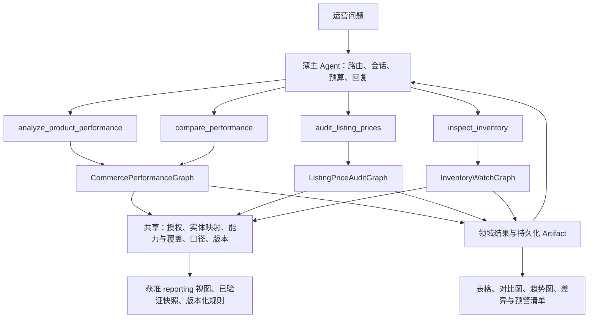

# 首位运营用户的跨平台工作流：子图与 Tool 设计

日期：2026-09-11。范围：用户明确提出的商品运营、平台 / 店铺对比、上架售价复核、库存预警；本轮交付设计与计划修订，不执行业务系统变更。用户补充确认：标准售价「先由用户在查询时指定」，利润「按已有数据表项设计」。

## 1. 当前基线与本次调整

代码基线 `0624220`：`c335af9` 商品档案同步、`f2662bf` 目录引用、`0624220` 名称展示已提交。沿用 `catalog/`、005 / 007 迁移、`business_query/`、`runtime/`、固定指标、聊天与 SSE。Task 2 按“主体已实现、SKU 遗留与交付验收收尾中”衔接，不重新开发。

仍存在的业务缺口：

- `QueryRequest` 只有时间、店铺、指标和单一分组，没有商品 / SKU 筛选，也没有平台分组；名称可显示不等于已经能查指定商品。
- 商品按 `(shop, day, product, line_kind)` 聚合，SKU 主档和渠道上架映射尚未闭环。
- 当前目录 ref 由 kind / ERP 主键派生，不能证明不同平台商品已经归一；跨账号映射需要账号命名空间，已有 ref 必须保留兼容。
- 已有 `DomainResult` / 数据库约束只支持 `business_query` 和 `metric_result`；新增领域前必须显式扩展，不能直接拼新字段绕过白名单。
- 当前前端可显示表格与数值，没有本工作流需要的对比图表契约。

产品优先级调整：先交付这些确定性业务工作流；Schema 元数据目录同步建设，通用 Text2SQL、学习记忆与复杂分析执行器后置。库存与价格复核提升为近期独立领域。

## 2. 架构选择

选用 **4 个模型可调用的业务 Tool，3 个领域子图**。商品运营与平台运营共用一套经营事实、口径和聚合节点；价审、库存因数据时态与恢复方式不同而独立。

| 方案 | 判断 |
| --- | --- |
| 4 个 Tool / 3 个领域图，共享确定性节点 | 采用：业务意图清晰，避免商品 / 平台重复计算，主层一次调用能拿完整报告 |
| 1 个超宽 `query_anything` Tool | 参数和恢复分支相互耦合，价格 / 库存语义容易混用 |
| 每店 / 每指标一个低级 Tool，自由循环 | 跨店数量会耗尽预算，难以保证统一数据版本和覆盖 |



现有 `query_business` 保留兼容；在新经营图上线后，它作为旧请求适配器转入相同执行内核，不能同时执行新旧两条查询。`evaluate_promotion` 保留为已有假设测算工具，按明确预算测算意图启用；不参与四个新 Tool 的数据获取。

内部函数不直接暴露给主 Agent：实体解析、授权扩展、能力判定、事实加载、价格比较、库存去重、阈值判断、图表构建。主 Agent 不生成 SQL，也不逐店拉明细。

## 3. 公共输入与结果契约

### 输入

- `scope`：`mode=all_authorized|selected`、`platforms`、`shop_refs`。all_authorized 展开为当前用户获准且满足所选平台的店铺，不以有成交记录的店铺作为全集。selected 必须提供店铺或平台。显式越权引用返回 forbidden，不静默剔除。
- 平台列表服务端规范化到 `tb/pdd/fxg/jd/kuaishou`；淘宝 / 天猫分开，只有配置了版本化合并规则才允许作为同一组。未知平台不能猜测名称或能力。
- `product`：`ref` 与 `text` 二选一，可附 `sku_refs`。本地目录按授权查找；文本仅用于实体解析，不写入运行事件。多候选返回 needs_input 和有权查看的候选卡片；零候选为 unresolved，不能当销量零。模型优先传 opaque ref，已有聊天引用可复用，但每轮重新授权。
- 日期仍用北京时间 `[start,end)`。当前售价、当前库存使用 `as_of=latest` 和服务端 freshness policy；历史时点只有具备对应快照才接受。
- 真实身份、授权全集、连接与 deadline 由服务端上下文提供，不进入模型工具参数。

### 结果

继续采用 `DomainResult` 的 `success/partial/missing_data/needs_input/failed`，通过契约 v2 增加以下明确字段，旧 v1 记录仍可读：

| 字段 | 用途 |
| --- | --- |
| `requested_scope` / `evaluated_scope` / `excluded_scope` | 原范围、已评估范围、获准但无法评估的店铺及原因；不泄露未授权店铺清单 |
| `requested_window` / `trend_window` / `snapshot_at` | 不把历史交易与当前快照混为同一时间口径 |
| `metric_statuses` | 按店铺 / 平台 / 指标列出 available / missing / unsupported / incomparable |
| `metric_basis` / `currency` / `unit` | 销售、利润、价格、库存口径与单位 |
| `provenance` | 数据批次、各来源截止、映射、指标、catalog、规则与图版本 |
| `error` / `recovery` / `termination_reason` | 机器可执行恢复，不依赖聊天文本 |
| `artifacts` | 结果数据集、图表定义、差异表或预警表引用 |

“部分可用”的规则：有两家可用而第三家缺数据时，可返回两家数据和第三家的缺口；总结果为 partial。禁止标注“所有店铺合计”。完整数据中的 0 与缺失 null 分开；仅对同口径、同窗口、质量合格的子集排序，并明确排名范围。

新增 Artifact 类型白名单：`metric_result`（兼容）、`comparison_table`、`trend_series`、`chart_spec`、`price_audit`、`inventory_alerts`。各类型采用独立 Pydantic schema / 判别联合，不能用任意 dict 替代校验。模型收到精简汇总与引用；授权展示层解析名称，分页明细留在 Artifact。

## 4. Tool 目录

下表是公开输入的完整业务字段；通用 `scope` / `product` 遵循第 3 节，内部实际 ID 不进入此接口。

| Tool | 业务输入 | 输出 |
| --- | --- | --- |
| `analyze_product_performance` | `product`；`scope`；`start/end`；`metrics`；`sales_basis`；`profit_basis=none|existing_fields`；`trend_days=7`；`comparison=none|previous_period`；`opportunity_policy_ref?` | 商品跨店指标表、SKU 明细引用、七日趋势、同口径店铺排名、低利润候选及限制 |
| `compare_performance` | `scope`；`start/end`；`group_by=platform|shop`；`metrics`；`sales_basis`；`profit_basis=none|existing_fields`；`trend_days=7` | 平台或店铺对比表、柱状图、可选趋势；shop 分组要求 scope 中恰好一个平台 |
| `audit_listing_prices` | `product`；`scope`；`as_of=latest`；`price_basis=list_price|campaign_price`；`expected_prices` | 目标上架范围、逐店 / 链接 / SKU 实价与用户指定目标价差异、缺失与无法判定清单 |
| `inspect_inventory` | `products=all|selected`；`product_refs`；`sku_refs`；`scope`；`levels=[physical_total,shop_sellable]`；`as_of=latest`；`threshold_policy_ref?`；`thresholds?` | 按商品 / SKU 的去重实物总库存、店铺可售库存、补货 / 调拨候选、缺规则与快照过期项 |

校验：日期跨度沿用最多 366 天；trend_days 首版固定 7。`metrics` 首版枚举 `sold_quantity/sales_amount/weighted_avg_paid_price/product_gross_profit_reference/product_gross_margin_reference/erp_gross_profit_reference`；按第 5 节逐项判能力。`sales_basis=erp_effective_parent|verified_payment`；前者支持现有商品父行经营数据，后者支持已有商业支付事实，不能将其与前者数量强行相除。利润只按已存在字段生成，缺口不转换成零。

`expected_prices` 为用户在当前问题中明确指定的一个或多个目标价，元素为 `applies_to=all_selected|sku|shop_sku`、`shop_ref?`、`sku_ref?`、`expected_amount`、`currency`、`price_basis`。目标价使用 Decimal 字符串；默认精确比较，币种按经核验的货币精度规范化，不能凭模型自行给容差。只有明确“所有规格统一价”时 all_selected 才覆盖多 SKU；否则先澄清规格。重复规则相互冲突返回 needs_input。目标价快照写入本次 audit 供追踪，默认不变为长期价格表，也不从上一轮悄悄继承；缺少当前明确输入时返回 needs_input。库存 selected 时至少给一个商品 / SKU 引用，all 时引用列表为空。

库存 `thresholds` 与 `threshold_policy_ref` 互斥；inline 每项为 `level/sku_ref/shop_ref?/pool_ref?/quantity/unit`，仅接受当前用户明确输入并按获准库存范围验证。没有 inline 输入时使用配置的规则；两者均不存在则返回库存数据与 unconfigured，不自行设阈值。

经营 Tool 的 sales_basis 优先采用用户明确指定值；按现有字段的默认报告将商品销量 / 金额标为“ERP 有效销售父项口径”，商业支付事实单独标为“已验证支付口径”。要求平台完整支付 GMV 而来源不足时标不可用；不能用默认报告替代该要求。用户说“利润”时按已确认的 existing_fields 模式输出第 5 节可用参考指标及其字段来源，禁止推定未落表费用组成。

示例（合成引用，仅表示接口形状）：

```json
{
  "tool": "analyze_product_performance",
  "arguments": {
    "product": {"ref": "ent-a1b2c3d4"},
    "scope": {"mode": "all_authorized", "platforms": [], "shop_refs": []},
    "start": "2026-09-01", "end": "2026-09-11",
    "metrics": ["sold_quantity", "sales_amount", "weighted_avg_paid_price", "product_gross_profit_reference"],
    "sales_basis": "erp_effective_parent", "profit_basis": "existing_fields",
    "trend_days": 7, "comparison": "none"
  }
}
```

趋势窗口独立标注为 `[end-7 days,end)`，此例为 09-04 至 09-11。即使主期间不足七天，也必须显式展示独立趋势区间并单独检查覆盖；缺一天留 gap，不滑动到另一组七天。

## 5. 业务语义与数据门槛

### 5.1 商品身份

映射链：`企业商品 → 企业 SKU → 平台 / 账号 / 店铺 / listing / 平台 SKU → ERP 商品 / SKU`。映射保留有效时间、来源、approved / ambiguous / unresolved 状态、包装单位与换算。名称相似只产生候选，不能自动合并不同规格；无历史销量的新上架链接也必须可识别。

套件以父项计算销售金额；库存通过 BOM 换算组件，但父件与组件不重复计总。跨平台多件装先统一单位；不同 SKU 不在未知换算时强行合成一个平均售价。

### 5.2 销量、金额、售价与利润

| 指标 | 定义与限制 |
| --- | --- |
| 销量 / 销售金额 | 首版复用有效销售父行 quantity / allocated_paid_amount，按 paid_at 分日，继承 active / 赠品 / allocation_verified 门禁，标“ERP 有效销售父项口径”；全部店铺比较还须同窗完整覆盖。商业支付 amount 是独立事实与口径，不冒充同一集合 |
| 成交均价 | 同一事实集合的分摊成交金额 ÷ 对应成交件数；先统一单位，分母为 0 时 null；不能平均日均价 / 店铺均价 |
| 当前上架价 | 对应渠道 listing SKU 在读取时点的标价；独立于成交均价、ERP 档案建议价和采购成本 |
| 商品毛利参考 | 对已验证普通销售行，`SUM(allocated_paid_amount - raw_unit_cost * quantity)`；时间 / 状态集合与商品收入一致。行成本缺失、单位未核验、混合赠品成本不清、套件 / 组合 / 加工成本语义不清时，不发布完整商品毛利 |
| ERP 毛利参考 | `bi.orders.raw_gross_profit`，按唯一 ERP 单据先聚合，适用于店铺 / 平台 ERP 参考面板；不得连接订单行后重复累加，也不得按比例分摊到商品来伪造商品利润 |
| 商品毛利参考率 | 同一完整有效行集合的商品毛利参考 ÷ 同集合收入；分母为 0 时 null，成本覆盖不全时不拿已知部分成本除以全部收入，不平均店铺利润率 |

现有字段映射：`order_items.raw_unit_cost` ← 订单行 cost；`orders.raw_cost` ← 单据 cost；`orders.raw_gross_profit` ← 单据 grossProfit；`products.purchase_price` ← 当前商品档案采购成本。前两类成本可显示为来源参考，但不能重复扣除；当前档案成本不能回填成历史销售成本。来源填 0 仍需确认是否真实零成本，不能当作自动通过质量门禁。

第一版不新增虚构费用，不提供净利润 / 贡献利润计算，也不把 `paid_amount - refund_amount` 称为利润。现有售后主要是头表，商品级退款 / 退回成本分配未具备时，商品毛利参考明确“未扣售后、平台费、运费、广告费”；完整净利与退货后商品利润留作未来数据扩展。销售父项、ERP 单据毛利与商业支付事实可同报告展示，但分面标注，不能混成一个利润率。

“重点投放店铺”首版输出可核对的候选：销售份额、趋势、毛利率、样本量和覆盖。缺广告实耗 / 归因数据时不声称 ROAS 最优，不自动下预算建议。低利润阈值与最小样本来自版本化规则；没有规则只提供指标与排序，不虚构阈值。

### 5.3 跨平台能力

能力表按 `(平台,账号,店铺,实体,指标,口径,时间窗口)` 维护，不能仅按“平台有 API”标可用。历史核查报告（2026-09-06）显示部分淘系 / 拼多多来源缺完整支付字段，库存只有 SKU / 仓库样本；这不是今天的可用性承诺。

新接入必须重新取证并对账。不可用平台显示“未接入 / 缺字段 / 未对账”，允许经营者看到其余可比项；禁止用出库金额补支付 GMV 后一起排行。京东、快手不能从其他平台的样本推定已支持。

### 5.4 上架复核的标准

目标店铺集合来自用户本次选择的已授权店铺全集，不来自“已有 listing / 订单”的集合。正确价由用户当次指定，可统一或逐 SKU / 店铺指定；本次输入连同 price_basis / currency 冻结为审计依据。长期价格表不是首版前置任务，模型不能自行从历史售价或档案建议价补标准。冲突、缺规格或缺价格返回 needs_input。

默认按标价 list_price 比较。活动价只有在规则和来源都明确活动条件时比较；会员价 / 券后价不能用无条件标价替代。最新快照超过该来源 freshness policy 时标 stale，不报告“正确”。

状态：`match/mismatch/not_listed/not_on_sale/missing_standard/unmapped/stale/unsupported/unknown`。确认 not_listed 要有店铺全量上架枚举或明确查无商品的证据；缺列表 / 无权限不能当未上架。一个 SKU 多链接逐个复核，不能只取最便宜链接。

### 5.5 库存预警的两种库存

1. **实物 / ERP 可用库存**：以 `(企业,库存池,仓库,SKU,快照批次)` 唯一事实汇总一次，用于判断是否补货。可用、锁定、在途分别展示；如果源字段已经是可用量，不再次减锁定量。
2. **店铺渠道可售库存**：以 `(平台,店铺,listing,SKU,快照)` 读取，用于判断是否需要补充渠道配额；共享池展示数、渠道配额与独立库存必须分型。

例如同一仓库可用量 100，同时被 3 家店展示为 100，实物总量仍是 100，不能加为 300。店铺为 0、共享仓库充足时给“调整店铺配额候选”；共享实物低于阈值给“补货候选”。总池包含用户未获准的仓库或其他主体数据时，需要独立 inventory-pool 授权；不能由店铺授权推导可看全公司仓库。

阈值是版本化策略：按 SKU、库存池 / 店铺、生效时间、数量单位配置，判定 `quantity <= threshold`。缺阈值返回 unconfigured，缺库存 / 过期快照返回 unknown / stale，负库存独立 data_anomaly。全商品盘点按完整目录分页，在后端扫描全范围，再按风险取 Top N 展示；返回 scanned/expected/truncated，不能只扫描热销商品。

## 6. 三个领域子图

### CommercePerformanceGraph

`resolve_scope → resolve_product_if_needed → resolve_metric_basis → check_capabilities_and_coverage → freeze_versions → plan_fixed_queries → execute_aggregates → compute_metrics → build_comparison_and_trend → classify_findings → persist_artifacts → finalize`

- resolve_product 内含跨渠道映射、SKU 歧义与单位归一，参数澄清提前终止。
- 以集合查询同时加载各店 / 平台，交易、成本、退款 / 费用先按正确粒度独立聚合，再按已验证关联连接；避免 one-to-many JOIN 放大金额。
- 日趋势与汇总在同一只读事务快照 / 已冻结批次执行；跨源快照还要检查实际源截止一致性，数据库事务一致不代表渠道时间一致。
- 两个公开 Tool 调用同一图，分别固定 report_kind 为 product 或 comparison；单次调用生成汇总、趋势和图表，内部节点不消耗额外模型 Tool 回合。
- 单指标 / 单来源不可用可降级 partial；Artifact 保存失败、授权失败与契约错误不可降级成成功。

### ListingPriceAuditGraph

`resolve_scope_product_and_skus → load_expected_listing_roster → capture_user_expected_prices → check_listing_source → load_listing_snapshot → verify_completeness_and_freshness → join_expected_and_actual → compare_decimal_prices → classify_discrepancies → persist_audit → finalize`

- 用期望 roster LEFT JOIN 实际上架，而非只检查抓到的链接。
- 上架后查询可通过已批准连接器触发一次有预算的只读刷新；没有刷新能力就返回快照时间和 stale，不伪装成实时。
- 输出 summary 的分母固定为期望复核项；只有所有项都有新鲜、完整、匹配的证据才说“全部正确”。缺标准价可返回已采集价格与 missing_standard，但不判通过。
- 不包含自动改价 / 上架节点。

### InventoryWatchGraph

`resolve_full_catalog_and_scope → authorize_inventory_pools → load_inventory_policy → check_source_capabilities → load_snapshots → check_completeness_and_freshness → normalize_units_and_deduplicate_pools → compute_total_and_shop_levels → evaluate_thresholds → classify_actions → persist_alerts → finalize`

- physical_total 与 shop_sellable 各自取源、质量状态和快照时点；一个可用另一个缺失时分别报告。
- 库存快照必须绑定 batch_id；禁止在一次总量中混用不同完成批次，或把当前库存标成历史库存。
- 首版是用户发起的只读检查，输出预警结果。持续定时预警作为该图后续调度入口，需另定渠道和通知规则；本计划不创建 Codex 提醒或发送外部通知。
- 不包含采购、库存调整或补货下单节点。

## 7. 机器状态、恢复与预算

共享状态包含 `run_id/root_request_id/domain/graph_version/node/revision/request_fingerprint/attempt_no/recovery_count/deadline/source_batches/catalog_version/mapping_version/metric_version/policy_version/artifact_refs/error`。节点输入输出和 SQL / 原始返回留在受控运行空间；主层历史只保留请求、有限摘要和引用。

领域状态分别增加：经营图的 resolved_product、metric_plan、trend_window、coverage_by_metric；价审图的 expected_roster_ref、listing_snapshot_ref、audit_counts；库存图的 physical_snapshot_ref、channel_snapshot_ref、inventory_pool_refs、threshold_policy_ref、scan_counts。全部使用安全引用，不持久化模型隐藏推理或自由错误文本。

| 错误 / 发现 | 恢复 |
| --- | --- |
| 实体歧义、口径缺失、价格标准缺失 | needs_input 或部分结果带 missing_standard；不猜测 |
| 未映射 SKU / 无来源能力 / 覆盖缺失 | 单元格不可评估，报告 partial / missing_data；不重复相同查询 |
| 快照过期 | 有批准刷新能力时最多一次只读刷新；否则返回 stale |
| 规则冲突、币种 / 单位不可比 | unassessable；不能靠取平均恢复 |
| 来源临时连接失败 | 事务回滚且预算足够时最多一次重试；总 deadline 不重置 |
| 权限失败 | 立即终止该请求，禁止扩大到其他来源绕过 |
| 图表不可渲染 | 保留已验证表格，warning；不得丢失业务结果 |
| 必需结果 Artifact 保存失败 | failed，不发布成功；可选 chart_spec 失败允许降级为表格 |
| 工具 / 时间预算耗尽 | 基于已持久化结果确定性总结，并披露未完成范围 |

共享外层仍保留 30 秒 deadline；单轮 Tool 上限不因店铺数增加。后台全量同步独立运行，查询不能偷偷发起长时间回填。超过预算的大范围盘点通过持久化作业返回 in-progress 展示状态（实现排期后启用），初版超限明确返回范围 / 调度建议，不裁剪成成功。

## 8. 图形输出

图表采用确定性 `ChartSpec`：`kind=bar|line|scatter`、`dataset_ref`、`x`、`y`、`series`、`unit`、`metric_basis`、`coverage_ref`。dataset 与 spec 指向同一 Artifact 版本，前端不可重算财务口径，也不接受模型生成 JavaScript / HTML 执行。

- 平台对比 / 单平台店铺对比：每个指标独立柱状图，柱状图零基线，不将数量、金额、利润率混在一个轴。
- 商品七天趋势：按店铺小多图 / 系列选择；缺失点断开并提示，真实零值落在 0。
- 商品机会视图：数据足够时可画销售金额 × 毛利率散点图，点大小为销量；这是候选筛选，不是投放效果证明。
- 图表与表格相互切换；点击平台只发一个带平台筛选的 compare_performance 请求，下钻不会绕过授权。
- 无数据平台保留原因标签；同类比较口径不同时分面或标不可比，不强行放在同一排序内。

## 9. 新数据实体与来源验收

| 实体 / 视图 | 用途 | 当前证据 / 接入门槛 |
| --- | --- | --- |
| channel_listing_map、SKU 主档、BOM / unit mapping | 跨平台同款、规格与共享库存归一 | Task 2 名称 / ref 可复用；渠道 / SKU 映射需补齐并核验 |
| source_capabilities、coverage_checks、ingestion_batches | 平台 / 店铺 / 指标能力及覆盖 | 当前单店覆盖框架扩展，单平台完成不解锁其他平台 |
| 现有 order_items / orders 的经营 reporting 视图 | 商品和平台经营图 | 复用销售父项、行成本、单据 ERP 毛利；只补受控视图及质量标记，退款 / 费用分配留作未来有来源时扩展 |
| listing_snapshots、listing_snapshot_items | 上架状态与实际价格 | 尚无已验证渠道在售价来源；ERP 档案 priceOutput 不能替代；可以接平台授权 API 或带时点与完整性声明的官方导出 |
| price_audit_expectations、expected_listing_rosters | 本次正确价与目标上架范围 | 用户当次指定的目标价与授权店铺集合快照；长期价格表非首版前置 |
| physical_stock_snapshots、channel_stock_snapshots、inventory_pools | 总库存 / 店铺库存 | 历史报告仅验证部分 ERP SKU / 仓库样本；渠道可售量需独立取证 |
| inventory_threshold_policies | 库存阈值与作用域 | 由经营者配置；缺配置显示未配置，不能判正常 |

固定模板先满足四类工作流，不需要为它们开放自由 SQL。源接口不明确的领域，先完成适配契约、导入校验和合成验收；真实功能开关必须等字段、授权、时效、分页完整性和对账证据全部齐备。

## 10. 验收样例与默认假设

| 场景 | 必须得到的结果 |
| --- | --- |
| A 商品两种 SKU 跨三平台五店 | 同款映射可追踪；SKU 不混价；按可比店铺排名与七日趋势 |
| 店铺 1：1 件 / 100 元；店铺 2：9 件 / 450 元 | 总成交均价 55 元，不能用两店均价平均成 75 元 |
| 三平台中一平台无完整支付来源 | 两平台可比数据 + 第三平台不可用原因；不输出完整三平台支付总额 |
| 新上架 SKU 没有成交 | 仍进入价格复核 / 库存检查，不因没有订单而消失 |
| 目标 5 店，采集到 4 店 | 第五店标 unknown 或有证据的 not_listed；不输出全部正确 |
| 两 SKU 标准价不同、同 SKU 两个链接 | 逐 SKU / 链接比较，保留全部不匹配项 |
| 三店共享仓库 100 件，各显示 100 | 实物总库存 100；店铺可售分别展示，禁止合成 300 |
| 店铺 0、仓库 100；两类阈值均已配置 | 店铺配额调整候选，不能误判成必须采购 |
| 价格 / 库存快照过期 | stale 并披露读取时刻，不判正确 / 安全 |
| 缺历史成本或费用 | 相应利润不可计算；销量 / 金额仍可独立展示 |
| 测试用户只能看 2 店 | 不因 all_authorized 或商品 ref 看到其他店数据 / 库存池 |

用户已确认：目标价由用户当次指定；利润按已有表项设计。因此首版只提供有证据的商品毛利参考 / ERP 毛利参考，不预设净利或贡献利润；库存阈值尚未给出，用版本化配置或当前明确输入，缺阈值标 unconfigured。所有自动改价、库存调整和投放动作都不在本轮实现范围内。

实施与依赖见 [修订后的当前计划](../plans/2026-09-11-data-and-query-closure.md)。
